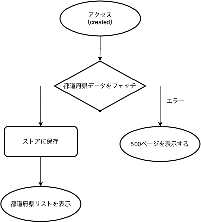

# 都道府県別の総人口推移グラフを表示する SPA を構築せよ

[課題内容・制約・注意事項](./REQUIREMENTS.md)

## 成果物

https://population-charts.web.app/

## アーキテクチャ

| 名前             | 目的                         | 備考                            | 参考 URL                                       |
| :--------------- | ---------------------------- | ------------------------------- | ---------------------------------------------- |
| Nuxt.js          | フロントエンドフレームワーク | SPA                             | https://ja.nuxtjs.org/                         |
| Highcharts       | グラフ描画ライブラリ         | Vue 用の highcharts-vue を使用  | https://www.highcharts.com/                    |
| Jest             | テストフレームワーク         |                                 | https://jestjs.io/ja/                          |
| Firebase Hosting | ホスティング                 |                                 | https://firebase.google.com/docs/hosting?hl=ja |
| RESAS API        | 都道府県情報の取得           |                                 | https://opendata.resas-portal.go.jp/           |
| GitHub           | リモートリポジトリ           | Issues, Milestones の管理も行う | https://github.co.jp/                          |
| GitHub Actions   | テスト, デプロイ             |                                 | https://github.co.jp/features/actions          |

## 各機能のフローチャート

### 1. 都道府県のチェックボックスを表示

### 2. 折れ線グラフの表示

## UI コンポーネント

| 名前                 | ファイルパス                        |
| -------------------- | ----------------------------------- |
| デフォルトレイアウト | @/layouts/default.vue               |
| エラーページ         | @/layouts/error.vue                 |
| トップページ         | @/pages/index.vue                   |
| ヘッダー             | @/components/BaseHeader.vue         |
| 都道府県リスト       | @/components/ThePrefectureList.vue  |
| チェックボックス     | @/components/BaseCheckbox.vue       |
| 人口構成グラフ       | @/components/ThePopulationChart.vue |

## テストケース

### ユニットテスト

| コンポーネント   | テスト名                                                                                                | 説明                                                                                                             |
| ---------------- | ------------------------------------------------------------------------------------------------------- | ---------------------------------------------------------------------------------------------------------------- |
| ヘッダー         | title が表示される                                                                                      | props の title が表示されるかどうか                                                                              |
| チェックボックス | label が表示される                                                                                      | props の label が表示されるかどうか                                                                              |
|                  | check なしから check ありの場合 true が返る                                                             | チェックをつけた時に check が実行され、引数に true が渡るかどうか                                                |
|                  | check ありから check なしの場合 false が返る                                                            | チェックをはずした時に check が実行され、引数に false が渡るかどうか                                             |
| 人口構成グラフ   | 都道府県が表示される                                                                                    | store にデータがある際に、グラフが表示されるかどうか                                                             |
| 都道府県リスト   | チェックなしからチェックあり&&データがない場合、データを fetch して selectedPref に prefCode を追加する | チェックをつける&&そのチェックが初めての時、データをフェッチし、表示する都道府県リストに追加されるかどうか       |
|                  | チェックなしからチェックあり&&データがある場合、selectedPref に prefCode を追加する                     | チェックをつける&&そのチェックが初めてでない時、データはフェッチせず、表示する都道府県リストに追加されるかどうか |
|                  | チェックありからチェックなしの場合、selectedPref から prefCode を削除する                               | チェックをはずすと、表示する都道府県リストからその都道府県が削除されるかどうか                                   |
| トップページ     | アクセスすると fetchPrefectures が実行される                                                            | アクセスした際に都道府県データがフェッチされるかどうか                                                           |
| Vuex             | fetchPrefectures を実行すると都道府県リストが prefectures にセットされる                                | 都道府県リストをフェッチできるかどうか                                                                           |
|                  | etchPopulationByPrefCode を実行すると人口データが populations にセットされる                            | 人口構成データをフェッチできるかどうか                                                                           |

### E2E テスト

手動でテストする。PR を出した時に発行される検証用 URL でテストする。

- 都道府県リストが表示されるかどうか
- 人口構成グラフが表示されるかどうか
- 表示が崩れていないかどうか

## ブランチ管理

- feature-\*\*\*ブランチは各機能の開発の際に使う
- develop ブランチは最新版
- main ブランチは安定板
